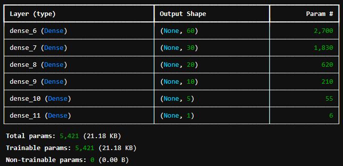
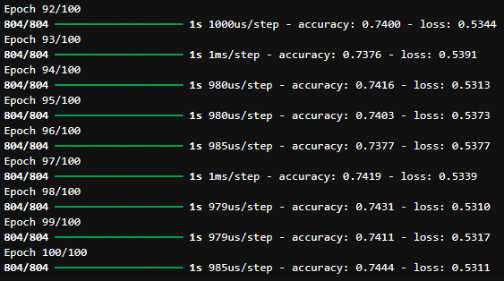
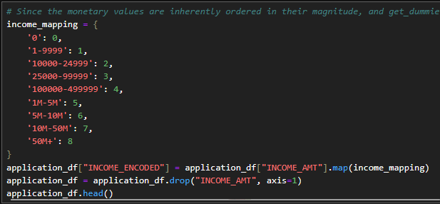

# Report on my Neural Network Models

## Overview
The purpose of this analysis is to explain the performance of the deep learning model I created for Alphabet Soup a nonprofit foundation. From Alphabet Soup’s business team, you received access to a CSV containing more than 34,000 organizations that have received funding from Alphabet Soup over the years. My goal was to use the features in the provided dataset to create a binary classifier that can predict whether applicants will be successful if funded by Alphabet Soup.

## Results
### Data Processing
  * What variable(s) are the target(s) for your model?
    - The target variable is <code>IS__SUCCESSFUL</code>
  * What variable(s) are the features for your model?
    - The following variables are features for my model:
    <code>APPLICATION_TYPE</code>, <code>AFFILIATION</code>, <code>CLASSIFICATION</code>, <code>USE_CASE</code>, <code>ORGANIZATION</code>, <code>STATUS</code>, <code>INCOME_AMT</code>, <code>SPECIAL_CONSIDERATIONS</code>, and <code>ASK_AMT</code>
  * What variable(s) should be removed from the input data because they are neither targets nor features?
    - <code>EIN</code> and <code>NAME</code> were removed since they are simply the identifying number and name, which ave no bearing on the success of the funded organizations.
### Compiling, Training, and Evaluating the Model
  * How many neurons, layers, and activation functions did you select for your neural network model, and why?
    - My best performing model had the following structure:
    
    For later versions of the model, I bumped up the number of nodes and/or number of layers, with little effect. I added a couple LeakyReLU layers on some other attempts as well, but they didn't help much.
  * Were you able to achieve the target model performance?
    - Unfortunately, I was not able to meet the target of 75% accuracy, though I got close, consistently around 74%.
    
    * What steps did you take in your attempts to increase model performance?
    - I tried creating more bins for rare occurrances in columns, adjusted the number of values for each bin, added more neurons to hidden layers, added more hidden layers, used different activation functions for hidden layers, and reduced the number of epochs to the training regimen. I tried dropping a column at one point, but it ended up just lowering my accuracy by a couple points overall.

## Summary
I tried a lot of reclassification at various levels. I thought I was onto something, remapping income sequentially, but I'm not sure how much of an effect it had.

I figured, since get_dummies() makes them completed unrelated, it might be fruitful to order the income ranges by te magnitude and map them to sequential integers to capture their inherent order.

As I said before, I also tried quite a bit of variation with number of layers and nodes, as well as a couple LeakyReLU layers.
I think trying Principal Component Analysis on it might prove interesting. If we could determine the weighted effect of each variable, it would be easier to determine how much noise could be cleared up by removing or simplifying certain features.

At this point, the model's accuracy plateaus rather quickly, so there are clearly aspects I have yet to grasp on this one. Perhaps I could have experimented more with activation types? Though ReLU seems to be the gold standard for these sorts of models.

More testing needs to be done, for sure.